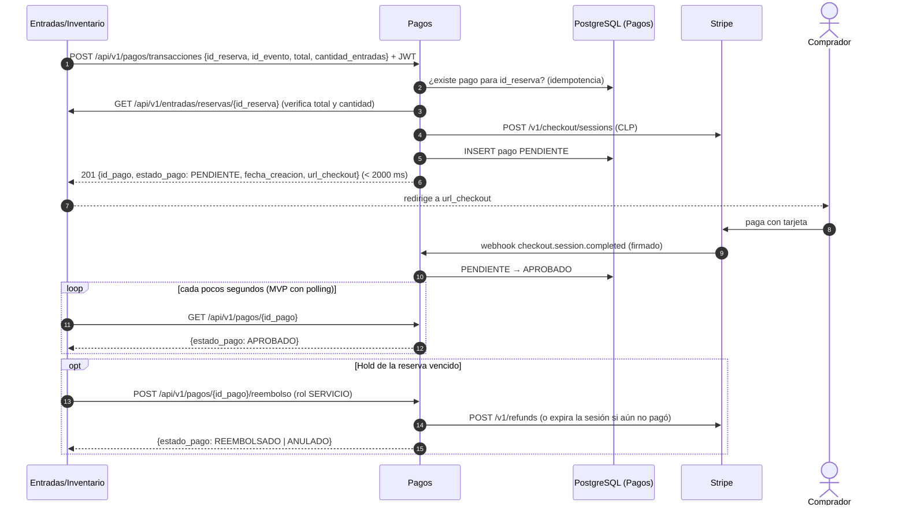
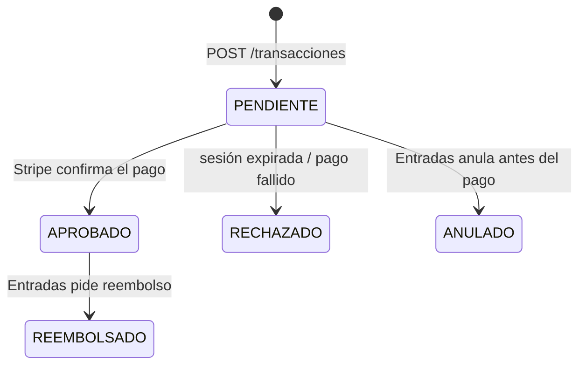

# Microservicio de Pagos — TicketU (TITEC 2026-2)

Módulo **Pagos** del proyecto TicketU (venta de entradas para eventos universitarios).
Cobra las entradas de los eventos pagados con **Stripe Checkout**, informa el estado del pago a **Entradas/Inventario**,
entrega el `id_pago` a **Promociones** y permite **anular o reembolsar** cuando Entradas libera una reserva.

**Stack:** Node.js 22 · TypeScript · Express 5 · PostgreSQL (local, Docker o Supabase) · Stripe · OpenAPI 3 · Postman/Newman · `node:test`

| Evidencia (rúbrica) | Dónde está |
|---|---|
| BE1: Swagger de servicios propios | [`docs/openapi.yaml`](docs/openapi.yaml) → `http://localhost:3000/api-docs` |
| BE2: Invocación a servicios de otros squads | [`src/integraciones/entradas.client.ts`](src/integraciones/entradas.client.ts) · [`docs/openapi-servicios-consumidos.yaml`](docs/openapi-servicios-consumidos.yaml) → `/api-docs/consumidos` |
| BE3: Swagger de servicios para otros módulos | Tags **Entradas (consumidor)** y **Promociones (consumidor)** en `/api-docs` |
| BD1–BD4: Diagrama relacional | [`docs/base-de-datos/diagrama-relacional.md`](docs/base-de-datos/diagrama-relacional.md) (generado desde la BD) |
| BD3: Script de creación + diccionario | [`db/schema.sql`](db/schema.sql) · [`docs/base-de-datos/diccionario-datos.md`](docs/base-de-datos/diccionario-datos.md) |
| CA1: Pruebas de funcionalidad | [`tests/`](tests) · resultado en [`docs/evidencias/pruebas-funcionales.txt`](docs/evidencias/pruebas-funcionales.txt) |
| CA2: Pruebas de integración | [`postman/`](postman) (colección + entorno) |
| Responsables por rol | [`RESPONSABLES.md`](../RESPONSABLES.md) |

---

## 1. Flujo de pago (contrato v2.1 con Entradas)



Si el webhook no llega (servidor sin URL pública), el `GET /{id_pago}` consulta la sesión en Stripe y actualiza el estado.
**Evolución planificada:** publicar `pago.aprobado` en el broker de eventos (RabbitMQ) en lugar de polling.

### Estados del pago



### Dos formas de cobrar (`metodo`)

| `metodo` | `url_checkout` apunta a | Cómo paga el usuario |
|---|---|---|
| `formulario` (**por defecto**) | Front de Pagos: `http://localhost:5173/?id_pago=...` | Formulario del equipo (Stripe Elements); la tarjeta va directo del navegador a Stripe |
| `checkout` | Página alojada por Stripe (Stripe Checkout) | En la página de Stripe |

Entradas crea el pago y redirige al usuario a `url_checkout`. El front obtiene monto y `client_secret` con
`GET /api/v1/pagos/{id_pago}/checkout`, cobra con Stripe y el estado se consulta con `GET /api/v1/pagos/{id_pago}`.

## 2. Endpoints

| Método | Ruta | Consumidor | Historias |
|---|---|---|---|
| `POST` | `/api/v1/pagos/transacciones` | Entradas | HU 1.1, HU 1.3 |
| `GET` | `/api/v1/pagos/{id_pago}` | Entradas (polling), front | HU 1.4, HU 1.6 |
| `GET` | `/api/v1/pagos/{id_pago}/checkout` | Front de Pagos | HU 1.1 |
| `POST` | `/api/v1/pagos/{id_pago}/reembolso` | Entradas | HU 3.1, HU 3.3 |
| `GET` | `/api/v1/pagos?id_usuario=&id_reserva=&estado=` | **Promociones**, front | HU 3.4 |
| `POST` | `/api/v1/pagos/webhooks/stripe` | Stripe | HU 1.3, HU 1.4 |
| `GET` | `/health` | plataforma | — |

### Política de autorización

Token JWT de **Auth** (`Authorization: Bearer ...`, HS256, claims `id_usuario`/`sub` y `rol`). El `id_usuario` se toma del token, nunca del body.

| Operación | Comprador (dueño) | Otro comprador | `SERVICIO` / `ADMIN` |
|---|---|---|---|
| Crear transacción | Sí | No aplica | Sí |
| Consultar pago | Sí, solo los suyos | No (403) | Sí |
| Listar pagos | Sí, solo los suyos | No (403) | Sí, todos |
| Anular / reembolsar | Sí, solo los suyos | No (403) | Sí |
| Webhook Stripe | sin JWT, se valida la firma `Stripe-Signature` | | |

## 3. Cómo ejecutar

Requisitos: **Node.js 22 o superior** y PostgreSQL (local, Docker o Supabase).

```bash
npm install
cp .env.example .env        # completar DATABASE_URL y JWT_SECRET
npm run db:init             # crea las tablas desde db/schema.sql
npm run dev                 # http://localhost:3000/api-docs
```

**Con Supabase:** crear el proyecto → *SQL Editor* → pegar y ejecutar [`db/schema.sql`](db/schema.sql) (o `npm run db:init`).
En `.env`: `DATABASE_URL=<connection string de Project Settings > Database>` y `DATABASE_SSL=true`.

**Con Docker (servicio + base de datos propia):**

```bash
cp .env.example .env
docker compose up --build
```

### Demo con Stripe real (modo test)

1. Crear cuenta en Stripe (modo test) y copiar la llave `sk_test_...` en `STRIPE_SECRET_KEY`.
2. Instalar [Stripe CLI](https://docs.stripe.com/stripe-cli) y ejecutar:
   `stripe listen --forward-to localhost:3000/api/v1/pagos/webhooks/stripe` → copiar el `whsec_...` en `STRIPE_WEBHOOK_SECRET`.
3. En `.env`: `PASARELA=stripe`, reiniciar con `npm run dev`.
4. Crear un pago (Swagger o Postman), abrir la `url_checkout` y pagar con la tarjeta de prueba `4242 4242 4242 4242` (fecha futura, CVC cualquiera).
5. `GET /api/v1/pagos/{id_pago}` → `APROBADO`.

> CLP no tiene decimales en Stripe: `total: 15000` = $15.000. Stripe exige un monto mínimo equivalente a ~0,50 USD.

### Tokens de prueba

```bash
npm run token                          # comprador usr-demo-1
npm run token -- svc-entradas SERVICIO # token de servicio (Entradas / Promociones)
```

## 4. Pruebas

| Comando | Qué hace |
|---|---|
| `npm test` | 58 pruebas funcionales y unitarias (`node:test`) contra PostgreSQL real (BD `DATABASE_URL_TEST`, se reinicia en cada corrida) |
| `npm run test:evidencia` | Igual, y guarda el resultado en `docs/evidencias/` (evidencia CA1) |
| `npm run test:integracion` | Ejecuta la colección Postman con Newman (servicio levantado con `PASARELA=mock`) y guarda el JUnit en `docs/evidencias/` (evidencia CA2) |

La colección [`postman/Pagos-TITEC.postman_collection.json`](postman/Pagos-TITEC.postman_collection.json) tiene 24 casos con resultado esperado
y 39 aserciones: creación, idempotencia, validaciones, autorización, webhook, listado para Promociones, reembolso y anulación.
Importarla junto a [`postman/pagos-local.postman_environment.json`](postman/pagos-local.postman_environment.json) y usar **Run collection**.
Si cambian `JWT_SECRET`, regenerar el entorno con `npm run postman:env`.

## 5. Base de datos

PostgreSQL con 3 tablas: `pagos`, `reembolsos` y `eventos_webhook_stripe` (deduplicación de avisos de Stripe).
`id_reserva` e `id_usuario` son **referencias sin FK** a otros microservicios (Database per Service): no se replican datos de negocio de otros squads.

- Script de creación con diccionario (`COMMENT ON`): [`db/schema.sql`](db/schema.sql)
- `npm run db:docs` lee el catálogo de la base de datos y regenera el [diagrama relacional](docs/base-de-datos/diagrama-relacional.md) y el [diccionario de datos](docs/base-de-datos/diccionario-datos.md).

**¿Por qué PostgreSQL y no MongoDB?** Aplicamos persistencia políglota (cada microservicio elige su BD): un módulo de pagos necesita
transacciones ACID (cambio de estado + reembolso en una sola operación), restricciones `UNIQUE` para garantizar la
idempotencia por `id_reserva` a nivel de base de datos, y `CHECK` para que no existan montos negativos ni estados inválidos.

## 6. Integraciones con otros módulos (tabla de dependencias TITEC 2026-2)

| Dependencia | Dirección | Servicio | Issue |
|---|---|---|---|
| Orden de compra (cantidad, total) | Entradas → Pagos | Recibimos `POST /transacciones`; invocamos `GET /api/v1/entradas/reservas/{id}` | INT-01 |
| Estado del pago y fecha de creación | Pagos → Entradas | `POST /transacciones` y `GET /{id_pago}` | INT-02 |
| `id_pago` | Pagos → Entradas | `POST /transacciones` | INT-03 |
| `id_pago` | Pagos → Promociones | `GET /api/v1/pagos?id_usuario=&estado=APROBADO` | INT-04 |

## 7. Estructura

```
src/
├── index.ts                     # arranque del servidor
├── app.ts                       # Express: middlewares, Swagger, rutas, manejo de errores
├── contenedor.ts                # arma las dependencias (inyección)
├── config/env.ts                # variables de entorno validadas
├── db/pool.ts                   # conexión a PostgreSQL
├── errores.ts                   # errores de dominio → códigos HTTP
├── middlewares/                 # autenticación JWT, CORS, errores
├── utils/jwt.ts                 # verificación de tokens HS256
├── integraciones/
│   ├── entradas.client.ts       # INVOCACIÓN al módulo Entradas (BE2)
│   └── pasarela/                # Stripe (real) y pasarela simulada
└── pagos/                       # routes → controller → service → repository (+ DTOs y tipos)
db/schema.sql                    # script de creación + diccionario
docs/                            # Swagger, diagrama, diccionario, evidencias
postman/                         # colección y entorno de pruebas de integración
scripts/                         # db:init, db:docs, token, postman:env
tests/                           # pruebas funcionales (node:test)
```
