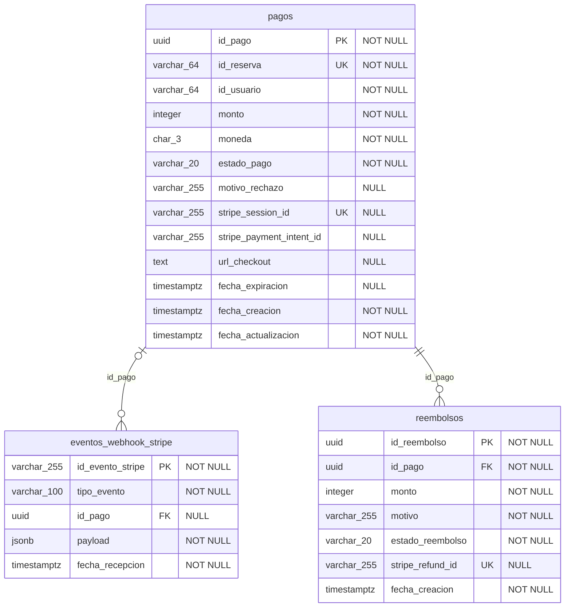

# Diagrama relacional — Microservicio de Pagos

> Generado automáticamente desde la base de datos con `npm run db:docs` (2026-09-30T20:44:03.452Z).
> GitHub dibuja el diagrama a partir del bloque Mermaid. Para una imagen: DBeaver/pgAdmin > ER Diagram,
> o en Supabase: Database > Schema Visualizer.

## Referencias a otros módulos (sin llave foránea)

Por el patrón *Database per Service*, estos identificadores apuntan a datos de otros microservicios.
Se guardan solo como referencia; no se replican datos de negocio de otros squads (ítem BD2).

| Columna | Módulo dueño del dato |
|---|---|
| `pagos.id_reserva` | Entradas/Inventario |
| `pagos.id_evento` | Panel organizador / Catálogo |
| `pagos.id_usuario` | Auth |

## Relaciones

| Restricción | Tabla hija | Columna | Tabla padre |
|---|---|---|---|
| `fk_eventos_webhook_stripe_pagos` | eventos_webhook_stripe | id_pago | pagos |
| `fk_reembolsos_pagos` | reembolsos | id_pago | pagos |

Todas las llaves foráneas apuntan a `pagos`: el diseño no tiene ciclos.
